# IT'S TIME TO DUEL!!!
### Intro

In order to make this interesting, we're going to work on the various steps to build a game similar to duel monsters.
But thats still a ways off. First lets get the tools you'll need to get started. 

### Step 1: Package Management
Writing software requires a lot of different tools to get things running easily. A popular package management software is
called [homebrew](https://brew.sh/) and it works on Mac and Linux operating systems. I'll be working on a Windows 
computer, so for package managment I'll be using a tool called [chocolatey](https://chocolatey.org/). 
Downloading a package management tool is step 1. 

### Step 2: Get Your Other Tools
Like a said before, theres a lot of tools needed to write software. Lets start with the packages needed. 
For this project we'll need

- Java 11 JDK

Java is a strongly typed (we'll get back to this later) programming language. 
It runs using the Java Virtual Machine (JVM). This means that any computer that has the JVM installed can run the app that you create.
Java can be installed with chocolatey using the command: `choco install openjdk11`.

To install, search for powershell and install it as administrator.

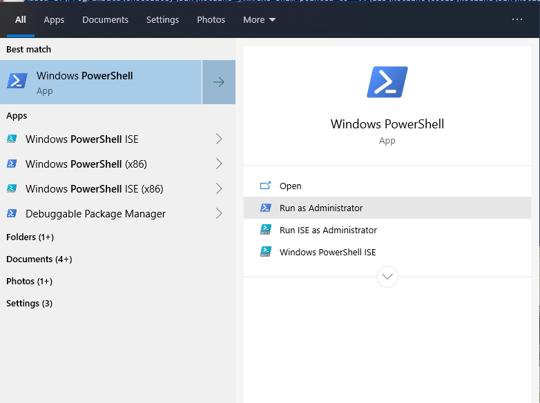

<br></br>

Once you've got it open, enter the command: `choco install openjdk11`. Then press enter. This will install the java11
jdk (java development kit) onto your computer. During installation you'll be prompted to confirm the installation.
Type in `y` for yes and then press enter.

<br></br>

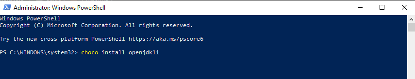

- Gradle 

Repeat the previous process, but this time install gradle using `choco install gradle`. Gradle is a dependency 
management software. Using gradle we can integrate code that other developers have written into our code. 
This way we don't have to start from scratch with every little feature.

- Intellij IDE

intellij is an Integrated Development Environment (IDE). It contains a ton of tools and features that make it easier 
to write software.  You can use [this link](https://www.jetbrains.com/idea/download/download-thanks.html?platform=windows&code=IIC)
link to install the free to use version of Intellij.

### Step 3: Starting Your First Server

For this project we'll be using a popular framework called [Spring](https://spring.io/quickstart).  Start by using the
[spring project generator](https://start.spring.io/) to create the basic project setup.
<br></br>

Here is the basic setup that we will use:
<br></br>
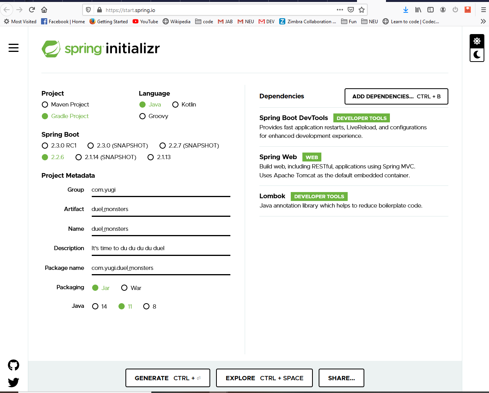

<br></br>
- Project: Gradle Project
- Language: Java
- Spring Boot: 2.2.6

The project Metadata is some additional info that's used to distinguish one project from another.
The `Group` field traditionally set up like a reverse website domain. For this project I set it
to be `com.yugi`. Artifact and Names field should just to keep things simple. I set it to be 
`duel_monsters` for this project. Set `Java` to `11` to match the version we downloaded earlier.
Click on `Add Dependencies` and add:
- Spring Boot DevTools
- Spring Web
- Lombok

Finally click `Generate` to download the project. Extract the zip file and copy the extracted folder
somewhere that's easy to find.

Now open up intellij. My version is a bit older and set up in dark mode so it will look a bit
different.

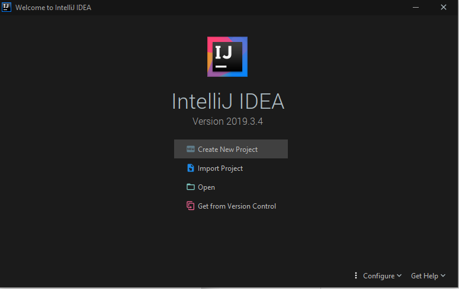

Click on `Import Project`

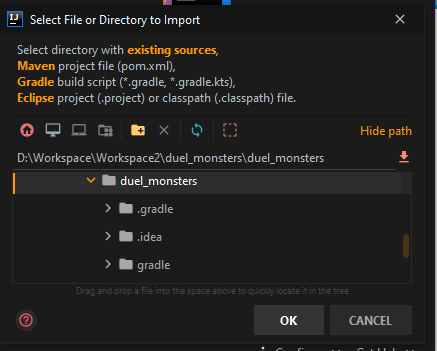

Select the duel_monsters folder that you created earlier (Make sure that you select the folder that contains
the `gradle` and `src` folders.

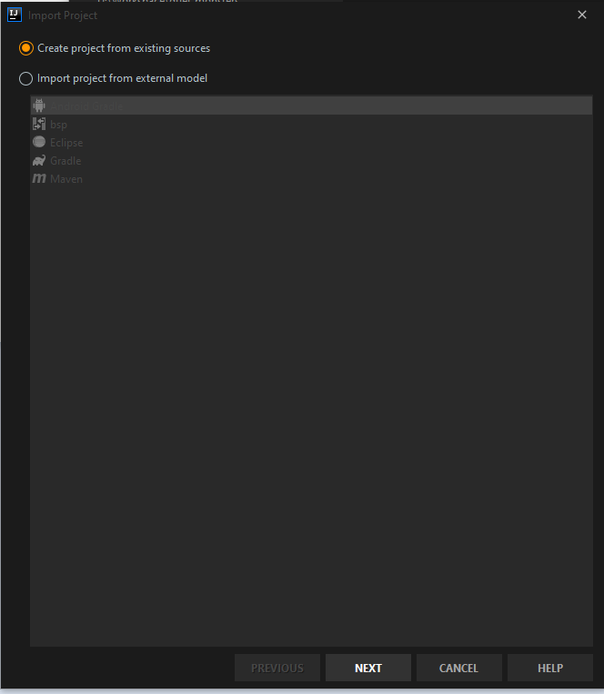 

Make sure that `Create project from existing sources` is selected and then just keep pressing `Next` and then 
`Finish` on the final window.

You should now have a setup similar to this:

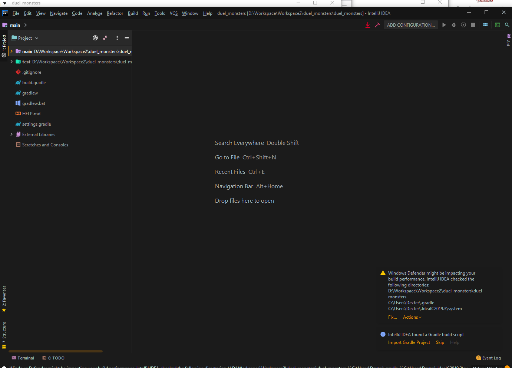

Go to `File > Project Structure`

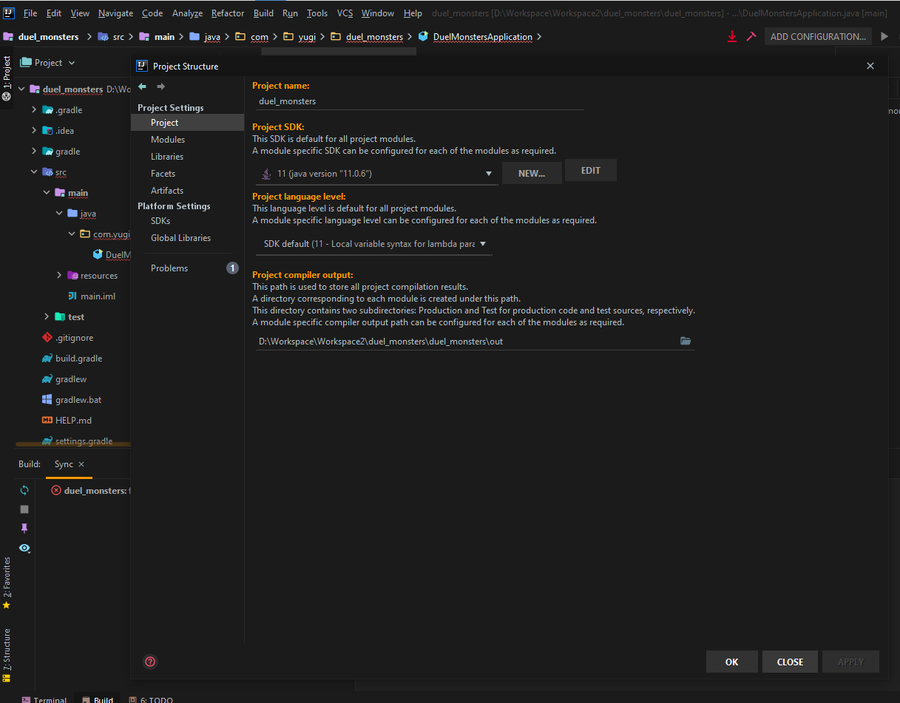

Select `Project` and then find the java 11 jdk that you downloaded as part of step 2. Then press `OK`.

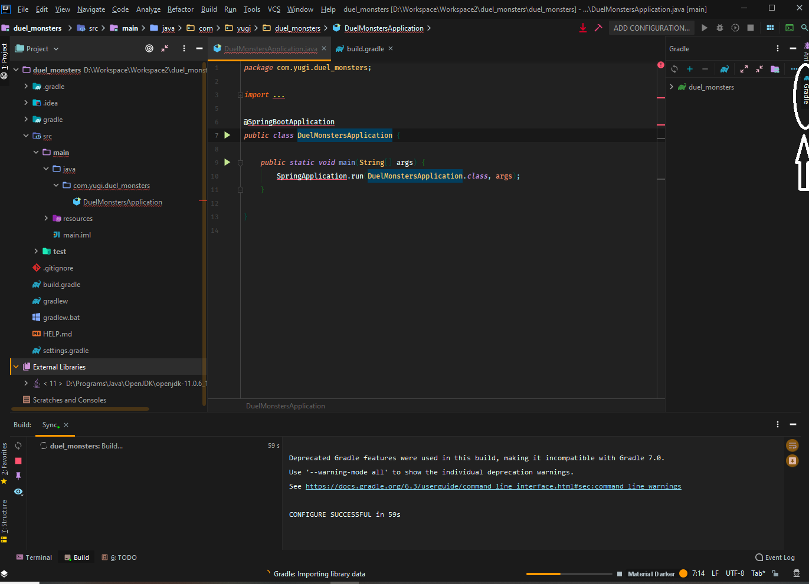

Select the gradle tab. 

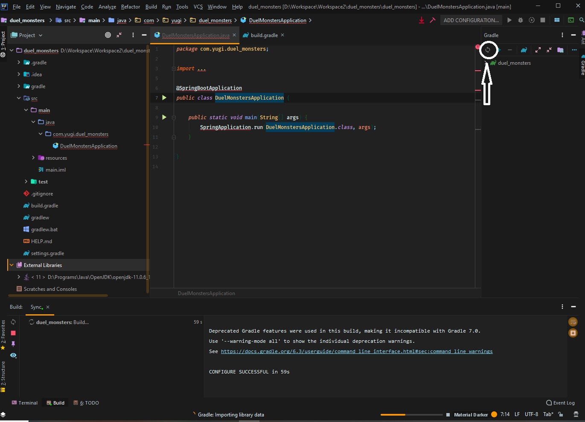

Press the refresh icon.

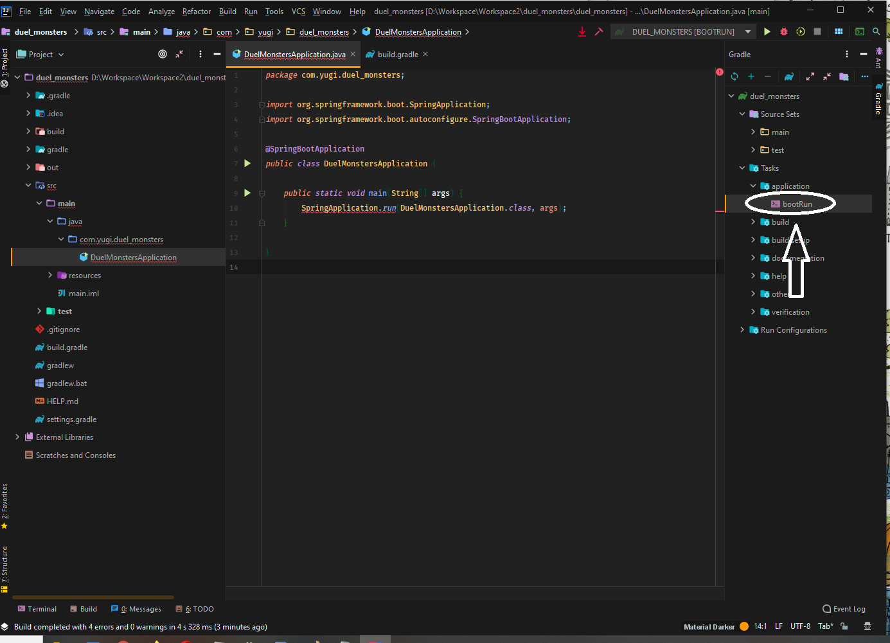

You should now be able to select `bootRun`. Double-click on `bootRun`, this will start up the server.

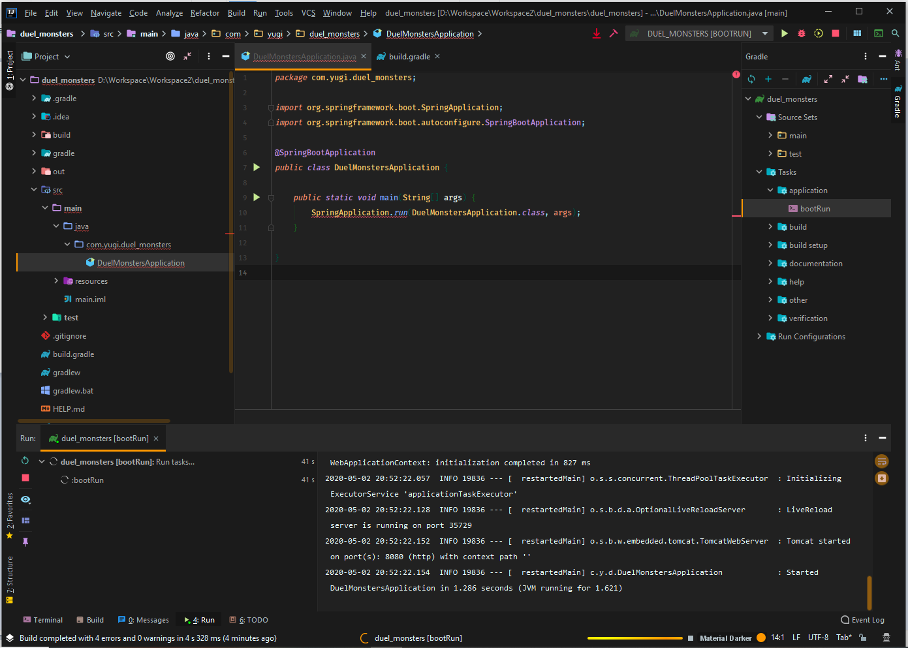

Once you see that the server is up and running, click the stop icon to stop it.

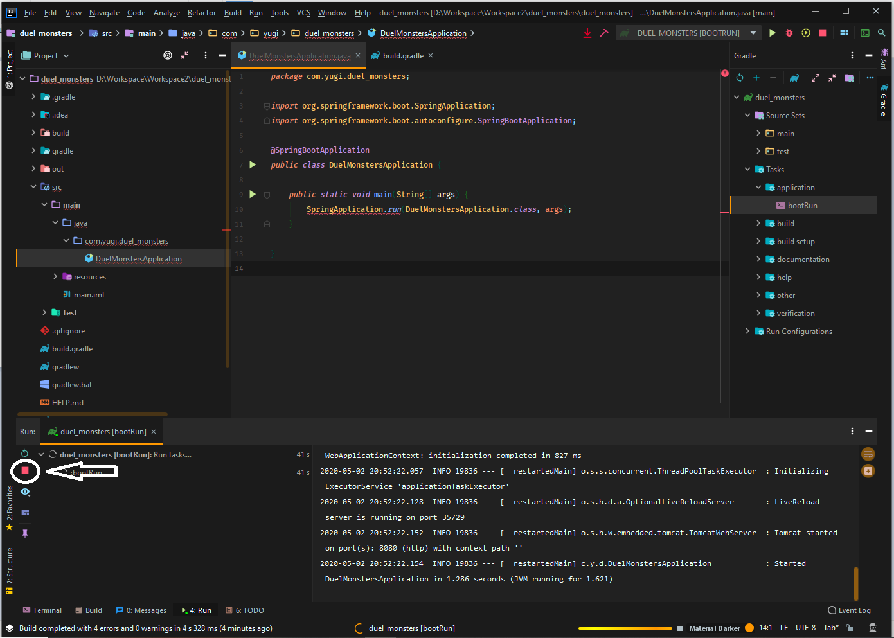

### Step 4: Adding your first endpoint

Above the class name add `@RestController`. This will let the compiler know to look at this
class for endpoint to setup.

Finally add the following code inside the class body:
```java
	@GetMapping("/duel")
	public String duel()  {
		return "It's time to du du du du du du duel!!!";
	}
```

Your class should look something like this:

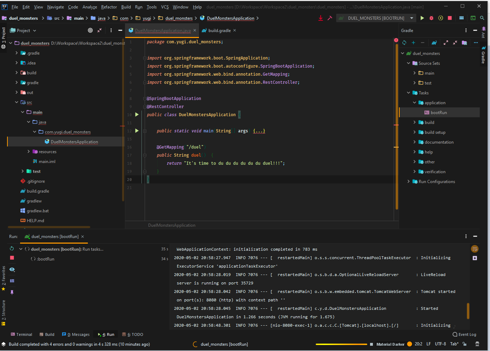

Run the application again. Go to `http://localhost:8080/duel` in any web browser. You should see something like:


