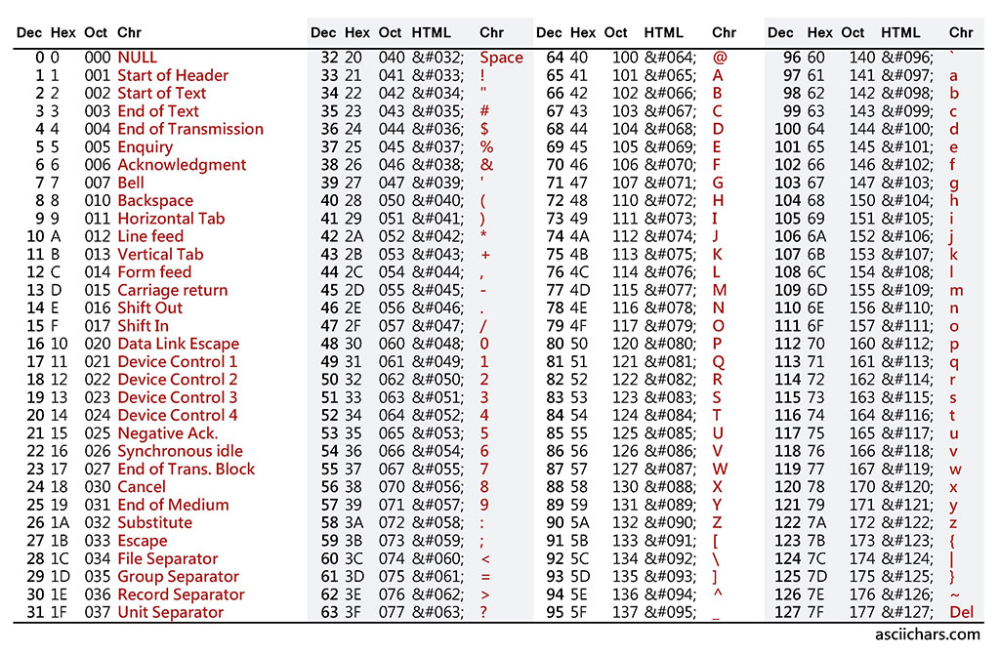

# Class amd Methods

## Overview
This is where things get more conceptual. Think of classes like nouns. They are representative of
data person, places, and things. Here's a very basic example of a class:
```java
public class MonsterCard {
    private String name;
    private int attack;
    private int defense;

    public MonsterCard(String name, int attack, int defense) {
        this.name = name;
        this.attack = attack;
        this.defense = defense;   
    } 

    public String getName() {
        return this.name;
    }

    public int getAttack()  {
        return this.attack;
    }

    public int getDefense()  {
        return this.defense;
    }
 
    public void increaseAttack(int increase) {
        this.attack = this.attack + increase;
    }
}
```

Lets break this example down. `public` is what's called an **Access Modifier**. Modifiers can
 be used to modify the access for classes, fields, methods, and constructors. You don't need to worry 
about this too much. To give a brief explanation, it determines what other objects (classes) can
see and and how those objects can interact with a class.

Think about these like viewer settings on a Facebook posts. 

The basic modifiers are:
- public: Anything can access this.  
    - This is like when a post is set to *Everyone*. Any object is able to see and interact
    with classes and methods with the `public` access modifier.
- protected: Only classes that are "related" to this one can interact with this
    - This is like when a post is set to *Only Friends*. 
- private: Only the class itself can access this.
    - This is like when a post is set to *Only Me*.
    
 Next `class` denotes what's being declared here, which is object definition, (remember think noun).
 The name of the class being declared is `MonsterCard`. The classes can be named anything as long
 as long as the name is alphanumeric and starts with a letter. Classes names traditionally start with
 an uppercase letter.
 
 Next are the class **fields**. **Fields** are the parts that make up a `class`. If we think of **classes** as nouns,
 class **field**s one should think of fields like descriptors, adjectives, and components. 
 For example, for our `MonsterCard` class we have 2 **fields**s, `name`, `attack` and `defense`. **Fields** are preceded 
 by a type. For the `name` fields the type is `String`. `String`s are a collection of characters consisting of letters, 
 numbers, white space, and symbols. Check out the table below to see the full range of characters a `String` can be made of. 
 


The next 2 **field**s are of `int` (short for integer) type.`int`s are round numbers ranging between -2<sup>31</sup>
and 2<sup>31</sup>-1 so they can represent very large and very small numbers. 
 
After that is the **constructor** call, denoted by `public MonsterCard(String name, int attack, int defense)` .
As a side note, `class`es can have multiple more then one **constructor** . The `class` **constructor** is the
blueprint on how to create an instance of a `class`. In order to create a basic creature card we need the creature name, 
attack, and defense of that creature. 
For example:
```java
class Main {
    MonsterCard blueEyesWhiteDragon = new MonsterCard("Blue-Eyes White Dragon", 3000, 2500);
}
```

## Assignment
1) Update the MonsterCard class to include the fields:
    - creatureTypes
    - level
    - attributeType

2) Create 3 endpoints that respond with 3 different creatures