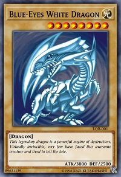
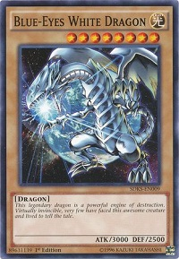

# Same? Same. Equality and Enums

## Sameness and Equality 

What does it mean when we say 2 objects are equal? For example, check out the 2 cards below:

___

Both cards are clearly 'Blue Eyes White Dragon'. Same attack, defense, level, attribute, and creature types. Even the
flavor text is the same. For all practical purposes both of these cards are the same. The only real difference is the
artwork. 

So why is this important? In java there are 2 ways to compare objects `==` and `equals`. `==` does a check to see
if 2 objects have the same value in memory and by default `equals` does the same thing. Lets take a look at some code*.

```java
class Main {
    public static void main(String[] args) {        
        MonsterCard be1 = new MonsterCard("Blue-Eyes White Dragon", 3000, 2500);
        MonsterCard be2 = new MonsterCard("Blue-Eyes White Dragon", 3000, 2500);
        System.out.println(be1 == be1);
        System.out.println(be1.equals(be1));
        System.out.println(be1 == be2);
        System.out.println(be1.equals(be2));    
    }
}
```

*<sub>
Background:
 There's some new stuff here that we should discuss first. A `main` method is the entry-point for a standard 
java application. It's always named `main` always had 2 key-words, an access modifier `public` and the key-word 
`static` (We'll cover this in a future lesson) and always takes an **array** of `String`s denoted by
`String[]`(We'll cover arrays in the next lesson).  We can even compile and run this app as a java application. Check
out the **Links to Further Reading** at the end for more info.
</sub>

If we run this application the output would look like:
```
true
true
false
false
```
This is because even  though `be1` and `be2` contain all the same data, they are both stored in difference places in
memory. Similar to holding 2 'Blue-Eyes White Dragon' cards in your hand. They are essentially the same card just 
two instances of that card taking up different parts of physical space. So how do we get past that? Well, in java
every class comes with some built in methods. The main ones being: `toString` ,`equals` , and `hashCode`. The defaults
for each method are not all that useful but we can manually override them to perform how we'd want.

```java
public class Player {
    private String name;
    private int lifePoints;
    
    public Player(String name) {
        this.name = name;
        this.lifePoints = 8000;
    }

    @Override
    public boolean equals(Object o) {
        if (this == o) return true;
        if (o == null) return false;
        if (o instanceof Player) {
            Player p = (Player)o;
            return this.name.equals(p.name) && this.lifePoints == p.lifePoints;
        }
        return false;
    }   
}
```

Let's deconstruct the `equals` method. It starts with `@Override`. This is used to to tell the java compiler to
use this `equals` method and not the default one found in the `Object` class. The `equals` method has the 
access modifier `public`, returns a `boolean` and takes in a single argument, an `Object` that in this case we just 
call `o`. All classes in java are considered to be of `Object` type. Inside the method body the first thing we
do is check if `this` object instance is the same object instance as `o` and returns `true` if it is. Then 
we check if the given argument `o` is the same type as `this` object. In this case `this` is a `Player`. If it
is we do something called *casting*. *Casting* is the act of telling the java compiler to try to treat an object
of one type as if it's a different type. It's done by putting the type we want to *cast* in parentheses before 
the instance name, `(Player)o`. In this case we cast the `Object` `o` to the `Player` type and assign it to the 
variable `p`. Then we check that `this` object's `name` is the same as `p`'s name and (denoted by `&&`) that
`this` object's `lifePoints` os he same as `p`'s `lifePoints`. Note that the class `String` `equals` method has
already been implemented. This is true for almost all classes that come with the java SDK. Lastly we return `false` 
if the `o` is not a `Player`.

## Enums
An **enum** is a special data type similar to a `class`. **enums** are useful when you have a limited number of possible
values that an object can be like cardinal directions NORTH, SOUTH, EAST, and WEST. Everything about **enums** have to be
predefined. For example:

```java
enum DuelPhase {
    DRAW_PHASE,
    STANDBY_PhASE,
    MAIN_PHASE_1,
    BATTLE_PHASE,
    MAIN_PHASE_2,
    END_PHASE;
}
```

Like classes **enums** can have fields too. We can update the **enum** `DuelPhase` to have an order.

```java
enum DuelPhase {
    DRAW_PHASE(1),
    STANDBY_PhASE(2),
    MAIN_PHASE_1(3),
    BATTLE_PHASE(4),
    MAIN_PHASE_2(5),
    END_PHASE(6);

    public int order;

    DuelPhase(int order) {
        this.order = order;
    }   
}
```
Because all of an **enum**'s possible values have to be defined, **enum**s can always be compared using `==` instead
of `equals`.

## Links For Further Reading
- [More on `static`](https://www.javatpoint.com/static-keyword-in-java)
- [More on running a java application in Intellij](https://www.jetbrains.com/help/idea/creating-and-running-your-first-java-application.html#)
- [More on running a java application from the command line](https://beginnersbook.com/2013/05/first-java-program/)
- [More on method overriding](https://www.javatpoint.com/method-overriding-in-java)
- [More on enums](https://docs.oracle.com/javase/tutorial/java/javaOO/enum.html)

## Assignment
1) Implement the equals method for the `MonsterCard` class.
2) Create an `enum` for the `MonsterCard` `attributeType`.
3) Create the `Player` class
4) Implement a `incrementLifePoints` method that increases a `Player`'s `lifePoints` ny the given amount
5) Implement a `decrementLifePoints` method that reduces a `Player`'s `lifePoints` ny the given amount